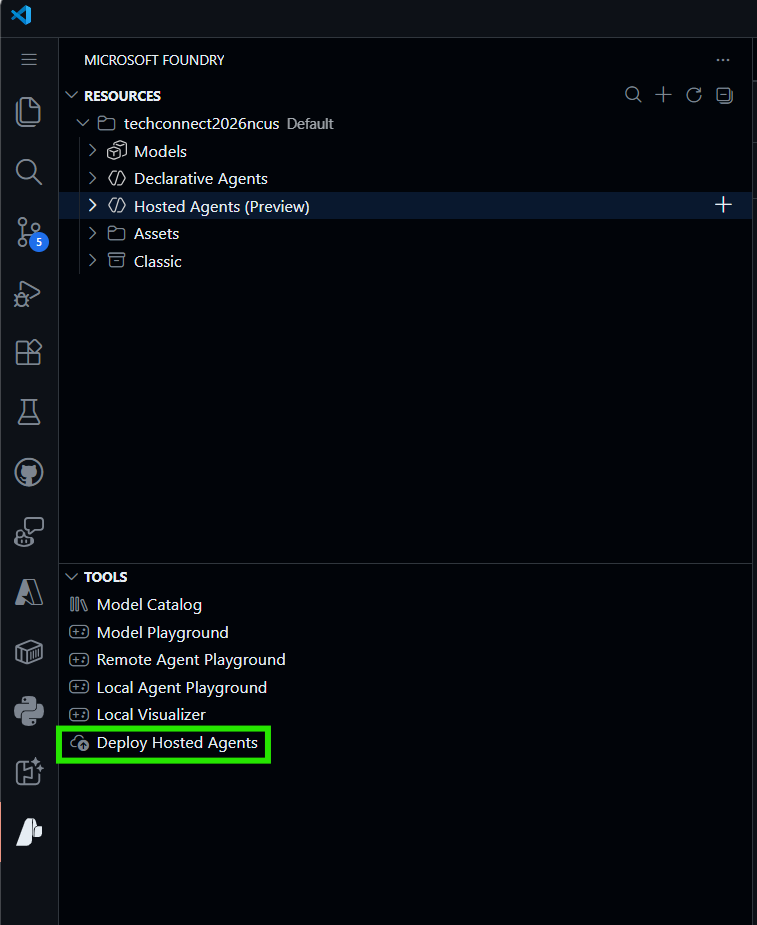

# Sequential orchestration agent

This repository guides you through how to deploy a hosted agent in Microsoft Foundry.

## Overview

This agent is designed to perform sequential orchestration tasks, allowing you to automate complex workflows and processes. By leveraging Microsoft Foundry's capabilities, you can easily deploy and manage this agent to enhance your operational efficiency.

## Requirements

First, you must log in through the Azure extension in Visual Studio Code. Then, you  have to set a default project in the Foundry extension. This will allow you to deploy the agent to the correct environment.

Before deploying the agent, create an `.env` file in the root directory of the project with the following content:

```env
# .env file
# Replace the placeholders with your actual values
AZURE_AI_PROJECT_ENDPOINT=<your-foundry-endpoint>
AZURE_AI_MODEL_DEPLOYMENT_NAME=<your-deployment-name>
```

Agents that are part of the sequential orchestration should have been created in the Foundry project. Follow the instructions from this repository: [agents-observability-tt202](https://github.com/dsanchor/agents-observability-tt202/tree/main/from-zero-to-hero#create-agents)

## Deployment

Click on the "Deploy" button in the Foundry extension in Visual Studio Code. This will initiate the deployment process for the sequential orchestration agent. Follow the prompts to complete the deployment.



**Important:** Before testing, we need to give permission to the Foundry Project Managed Identity. Use the portal to give "Azure AI User" role over the Foundry project.

## Troubleshooting

### Verify image 

If you encounter issues during deployment, ensure that the Docker image for the agent is correctly built and available. You can check the image.

First, enable ´Admin user´ in the newly created ACR. 

Then, use the following command to login to your Azure Container Registry (ACR):

```bash
docker login <your-acr-name>.azurecr.io -u <your-username> -p <your-password>
```

### Permission issues

Double-check that the Foundry Project Managed Identity has the necessary permissions to access the Azure AI resources. Ensure that it has the "Azure AI User" role assigned at the appropriate scope.